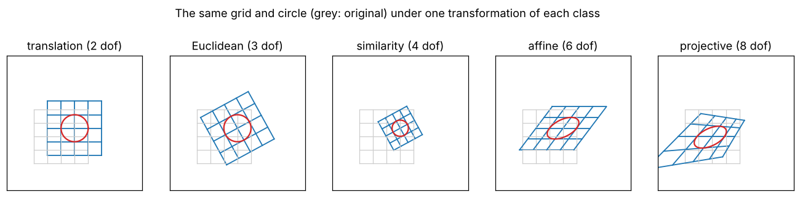

# 1 · Projective geometry of the plane

A camera maps a 3-D world onto a 2-D image, and in doing so it destroys lengths, angles and parallelism while
keeping straight lines straight. Euclidean geometry is the wrong language for that map; **projective geometry** is
the right one. This chapter builds the small amount of it that the rest of the module uses: homogeneous
coordinates, points and lines of the projective plane $\mathbb{P}^2$, and the hierarchy of plane transformations
from rigid motions to general homographies.

Notation: [00_notation.md](00_notation.md). Code: [`cpp/include/mvg/projective.hpp`](../cpp/include/mvg/projective.hpp).
Notebook: [`2_notebooks/exercises/01_projective_geometry.ipynb`](../2_notebooks/exercises/01_projective_geometry.ipynb).

## 1.1 Homogeneous coordinates

A point $\tilde{\mathbf{x}} = (u, v)^\top$ of the Euclidean plane is represented by any vector

$$
\mathbf{x} = (x_1, x_2, x_3)^\top = \lambda\, (u, v, 1)^\top, \qquad \lambda \neq 0 . \tag{1.1}
$$

Two homogeneous vectors that differ only by a non-zero factor represent the same point, written
$\mathbf{x} \simeq \mathbf{y}$. Going back is a division:

$$
\tilde{\mathbf{x}} = \left( \frac{x_1}{x_3},\; \frac{x_2}{x_3} \right)^\top, \qquad x_3 \neq 0 . \tag{1.2}
$$

The set of all non-zero 3-vectors modulo scale is the **projective plane** $\mathbb{P}^2$. It contains the Euclidean
plane (all vectors with $x_3 \neq 0$) and, in addition, the vectors with $x_3 = 0$. Those are **ideal points** or
**points at infinity**: $(x_1, x_2, 0)^\top$ is the limit of $(x_1/\varepsilon, x_2/\varepsilon)$ as
$\varepsilon \to 0$, i.e. the direction $(x_1, x_2)$. The same construction one dimension up gives $\mathbb{P}^3$,
where a scene point is $\mathbf{X} = (X_1, X_2, X_3, X_4)^\top$.

Why bother? Because two operations that are awkward in Euclidean coordinates become linear:

* a perspective projection, which divides by depth, becomes a matrix product followed by (1.2);
* incidence and intersection of points and lines become dot and cross products (next section).

## 1.2 Points and lines in $\mathbb{P}^2$

A line $a u + b v + c = 0$ is represented by $\mathbf{l} = (a, b, c)^\top$, again only up to scale. Multiplying the
line equation by $x_3$ gives the **incidence relation**

$$
\mathbf{x} \in \mathbf{l} \iff \mathbf{l}^\top \mathbf{x} = 0 . \tag{1.3}
$$

The relation is symmetric in $\mathbf{x}$ and $\mathbf{l}$: this is the **duality principle** — every statement
about points has a dual statement about lines obtained by swapping the two words.

**Line through two points.** The line $\mathbf{l}$ through $\mathbf{x}$ and $\mathbf{y}$ must satisfy
$\mathbf{l}^\top\mathbf{x} = \mathbf{l}^\top\mathbf{y} = 0$, so it is orthogonal to both vectors:

$$
\mathbf{l} = \mathbf{x} \times \mathbf{y} . \tag{1.4}
$$

**Intersection of two lines.** By duality,

$$
\mathbf{x} = \mathbf{l} \times \mathbf{m} . \tag{1.5}
$$

The cross product is written as a matrix product with the skew-symmetric matrix

$$
[\mathbf{a}]_\times = \begin{pmatrix} 0 & -a_3 & a_2 \\ a_3 & 0 & -a_1 \\ -a_2 & a_1 & 0 \end{pmatrix},
\qquad [\mathbf{a}]_\times \mathbf{b} = \mathbf{a} \times \mathbf{b} . \tag{1.6}
$$

*Worked example* (checked in `cpp/tests/test_projective.cpp`). The points $(1, 2)$ and $(3, 4)$ give

$$
\mathbf{l} = (1, 2, 1)^\top \times (3, 4, 1)^\top = (-2,\, 2,\, -2)^\top \simeq (1, -1, 1)^\top,
$$

the line $u - v + 1 = 0$. It meets the vertical line $u = 2$, i.e. $\mathbf{m} = (1, 0, -2)^\top$, at
$\mathbf{l} \times \mathbf{m} = (2, 3, 1)^\top$, the point $(2, 3)$.

**Parallel lines meet at infinity.** The lines $a u + b v + c = 0$ and $a u + b v + c' = 0$ intersect at

$$
(a, b, c)^\top \times (a, b, c')^\top = (c' - c)\, (b, -a, 0)^\top , \tag{1.7}
$$

an ideal point in the direction $(b, -a)$ of the lines. All ideal points lie on the **line at infinity**
$\mathbf{l}_\infty = (0, 0, 1)^\top$, since $\mathbf{l}_\infty^\top (x_1, x_2, 0)^\top = 0$. In $\mathbb{P}^2$ any two
distinct lines meet in exactly one point and any two distinct points span exactly one line, with no exceptions.

**Distance of a point to a line.** If the line is scaled so that $a^2 + b^2 = 1$ and the point so that $x_3 = 1$,
then $\mathbf{l}^\top \mathbf{x}$ is the signed Euclidean distance from the point to the line:

$$
d(\mathbf{x}, \mathbf{l}) = \frac{\lvert a u + b v + c \rvert}{\sqrt{a^2 + b^2}} . \tag{1.8}
$$

This is the error measure used for epipolar lines in chapter 6.

## 1.3 Projective transformations

A **projective transformation** (homography, collineation) of $\mathbb{P}^2$ is an invertible linear map of
homogeneous vectors,

$$
\mathbf{x}' \simeq H \mathbf{x}, \qquad H \in \mathbb{R}^{3\times 3},\ \det H \neq 0 . \tag{1.9}
$$

$H$ and $\lambda H$ define the same map, so $H$ has $9 - 1 = 8$ degrees of freedom. A homography maps lines to
lines: if $\mathbf{l}^\top \mathbf{x} = 0$ then $\mathbf{l}^\top H^{-1} H \mathbf{x} = 0$, so the image of the
line $\mathbf{l}$ is

$$
\mathbf{l}' \simeq H^{-\top} \mathbf{l} . \tag{1.10}
$$

Points transform with $H$ ("contravariantly"), lines with $H^{-\top}$ ("covariantly"). Mixing the two up is the
most common bug in code that transforms lines.

Where homographies occur: the image of a plane in the world (chapter 5), two images taken by a camera rotating about
its centre (chapter 5), and rectification of a stereo pair (chapter 7).

## 1.4 The hierarchy of transformations

Restricting $H$ gives a nested family of groups. Each level has fewer degrees of freedom and preserves more
geometric properties (HZ §2.4, table 2.1). In block form, with a $2\times 2$ matrix $A$, a 2-vector $\mathbf{t}$ and
the bottom row $(\mathbf{v}^\top, v)$:

$$
H = \begin{pmatrix} A & \mathbf{t} \\ \mathbf{v}^\top & v \end{pmatrix} . \tag{1.11}
$$

| Class | Form of $H$ | DoF | Invariants (each level also keeps those below it) |
|---|---|---|---|
| Translation | $A = I$, $\mathbf{v} = \mathbf{0}$, $v = 1$ | 2 | everything except absolute position |
| Euclidean (rigid) | $A = R(\theta)$ rotation, $\mathbf{v} = \mathbf{0}$ | 3 | lengths, areas |
| Similarity | $A = s R(\theta)$, $s > 0$, $\mathbf{v} = \mathbf{0}$ | 4 | angles, ratios of lengths, shape |
| Affine | $A$ any invertible, $\mathbf{v} = \mathbf{0}$ | 6 | parallelism, ratios of areas, ratios of lengths on parallel lines, $\mathbf{l}_\infty$ |
| Projective | any invertible $H$ | 8 | incidence, collinearity, cross ratio of four collinear points |

The test for the class of a given $H$ follows directly from the table (implemented in `classify_transform`):
normalize $H$ so that $H_{33} = 1$ (if $H_{33} = 0$ the map is projective); if the bottom row is not
$(0, 0, 1)$ it is projective; otherwise inspect $A$: $A^\top A = s^2 I$ for a similarity, with $s = 1$ for a
Euclidean map and $A = I$ for a translation.

**Affine maps fix the line at infinity.** For an affine $H$, (1.10) gives
$H^{-\top} \mathbf{l}_\infty = \mathbf{l}_\infty$, so parallel lines (which meet on $\mathbf{l}_\infty$) stay
parallel. A general homography moves $\mathbf{l}_\infty$ to a finite line — the **vanishing line** (the horizon in a
photo of a floor) — and parallel lines acquire a finite intersection, the **vanishing point**.

**The cross ratio.** For four collinear points with homogeneous coordinates
$\mathbf{x}_1, \dots, \mathbf{x}_4$, written as $\mathbf{x}_i \simeq \mathbf{a} + \mu_i \mathbf{b}$ on the line
through $\mathbf{a}$ and $\mathbf{b}$, define $|ij| = \mu_j - \mu_i$. The cross ratio

$$
\operatorname{cr}(\mathbf{x}_1, \mathbf{x}_2; \mathbf{x}_3, \mathbf{x}_4)
= \frac{|13|\,|24|}{|14|\,|23|} \tag{1.12}
$$

is unchanged by every homography (HZ §2.5). For finite points one can use signed distances along the line,
which is what `cross_ratio` does.

## 1.5 Decomposing a homography

Any homography with $v \neq 0$ in (1.11) can be scaled so that $v = 1$. If in addition
$\det(A - \mathbf{t}\mathbf{v}^\top) > 0$ (no reflection), it factors uniquely into a similarity, an affine part
and a pure projective part (HZ eq. 2.17):

$$
H = H_S\, H_A\, H_P
= \begin{pmatrix} sR & \mathbf{t}_s \\ \mathbf{0}^\top & 1 \end{pmatrix}
  \begin{pmatrix} U & \mathbf{0} \\ \mathbf{0}^\top & 1 \end{pmatrix}
  \begin{pmatrix} I & \mathbf{0} \\ \mathbf{v}_p^\top & 1 \end{pmatrix} , \tag{1.13}
$$

with $s > 0$, $R$ a rotation, and $U$ upper triangular with $\det U = 1$ and positive diagonal. Multiplying out,

$$
H = \begin{pmatrix} sRU + \mathbf{t}_s \mathbf{v}_p^\top & \mathbf{t}_s \\ \mathbf{v}_p^\top & 1 \end{pmatrix} . \tag{1.14}
$$

**Algorithm** (`decompose_projective`):

1. Scale $H$ so that $H_{33} = 1$ (fail if $H_{33} = 0$).
2. Read $\mathbf{v}_p^\top = (H_{31}, H_{32})$ and $\mathbf{t}_s = (H_{13}, H_{23})^\top$.
3. $M = H_{1:2,1:2} - \mathbf{t}_s \mathbf{v}_p^\top = sRU$; fail if $\det M \le 0$.
4. QR-factorize $M = Q\,U'$ with $Q$ a rotation and $U'$ upper triangular with positive diagonal (flip the sign of
   a column of $Q$ and the matching row of $U'$ where needed).
5. $s = \sqrt{\det U'}$, $U = U'/s$, $R = Q$.

The factorization says that the eight degrees of freedom of a homography split into 4 (similarity) + 2 (affine:
$U$ has three entries and unit determinant) + 2 (projective: $\mathbf{v}_p$).

## 1.6 Affine rectification from a vanishing line

The decomposition suggests how to undo perspective in two stages. If the image of the line at infinity,
$\mathbf{l} = (l_1, l_2, l_3)^\top$ with $l_3 \neq 0$, is known, the homography

$$
H_{\text{aff}} = \begin{pmatrix} 1 & 0 & 0 \\ 0 & 1 & 0 \\ l_1 & l_2 & l_3 \end{pmatrix} \tag{1.15}
$$

maps it back to $\mathbf{l}_\infty$: by (1.10), $H_{\text{aff}}^{-\top} \mathbf{l} \simeq (0, 0, 1)^\top$
(HZ §2.7.1). After applying $H_{\text{aff}}$, lines that are parallel in the world are parallel in the image again;
the remaining distortion is affine. The vanishing line itself comes from data: the images of two pairs of
parallel world lines meet in two vanishing points $\mathbf{v}_1 = \mathbf{l}_1 \times \mathbf{l}_2$,
$\mathbf{v}_2 = \mathbf{l}_3 \times \mathbf{l}_4$, and $\mathbf{l} = \mathbf{v}_1 \times \mathbf{v}_2$.

**Algorithm** (affine rectification of a plane):

1. Pick two pairs of image lines that are images of parallel world lines.
2. Intersect each pair with (1.5) to get two vanishing points.
3. Join them with (1.4) to get the vanishing line $\mathbf{l}$.
4. Build $H_{\text{aff}}$ with (1.15) and apply it to every point (lines with (1.10)).

## 1.7 Fitting a transformation of a given class

Given correspondences $\tilde{\mathbf{x}}_i \leftrightarrow \tilde{\mathbf{x}}'_i$, $i = 1 \dots N$, the
least-squares transformation of each affine-or-lower class has a closed form. Minimize

$$
\sum_{i=1}^N \lVert \tilde{\mathbf{x}}'_i - (A \tilde{\mathbf{x}}_i + \mathbf{t}) \rVert^2 . \tag{1.16}
$$

* **Translation** ($A = I$): $\mathbf{t} = \bar{\mathbf{x}}' - \bar{\mathbf{x}}$, the difference of centroids.
* **Similarity** ($A = \left(\begin{smallmatrix} a & -b \\ b & a \end{smallmatrix}\right)$): (1.16) is linear in
  $(a, b, t_u, t_v)$; each correspondence contributes the two rows
  $$
  \begin{pmatrix} u_i & -v_i & 1 & 0 \\ v_i & u_i & 0 & 1 \end{pmatrix}
  \begin{pmatrix} a \\ b \\ t_u \\ t_v \end{pmatrix} = \begin{pmatrix} u'_i \\ v'_i \end{pmatrix} . \tag{1.17}
  $$
  Because $(a, b) \mapsto (s, \theta)$ with $a = s\cos\theta$, $b = s\sin\theta$ is a reparametrization, the
  linear solution *is* the least-squares similarity. $N \ge 2$.
* **Affine**: six unknowns, rows
  $\left(\begin{smallmatrix} u_i & v_i & 1 & 0 & 0 & 0 \\ 0 & 0 & 0 & u_i & v_i & 1 \end{smallmatrix}\right)$, $N \ge 3$
  non-collinear points.
* **Euclidean** ($A = R$): the constraint $R^\top R = I$ makes the problem non-linear, but it has a closed form
  (orthogonal Procrustes; Arun et al. 1987, Umeyama 1991). With centred points
  $\mathbf{p}_i = \tilde{\mathbf{x}}_i - \bar{\mathbf{x}}$, $\mathbf{q}_i = \tilde{\mathbf{x}}'_i - \bar{\mathbf{x}}'$:
  $$
  \Sigma = \sum_i \mathbf{q}_i \mathbf{p}_i^\top = U D V^\top,\qquad
  R = U \operatorname{diag}(1, \det(UV^\top))\, V^\top,\qquad
  \mathbf{t} = \bar{\mathbf{x}}' - R \bar{\mathbf{x}} . \tag{1.18}
  $$
  The $\det$ term prevents a reflection. The same formula in 3-D is used again for visual odometry (chapter 9).

The **projective** case is also linear once the scale ambiguity is handled properly — that is the DLT of
chapters 3 and 5.

Fitting every class to the same correspondences and comparing residuals is a quick way to find the simplest
model that explains a pair of images: the residual drops sharply when the class becomes rich enough and stays flat
afterwards (notebook, section 4).

## 1.8 Common mistakes

* Comparing homogeneous vectors with `==`. Compare them up to scale: normalize both (e.g. to unit norm with a sign
  convention) or test $\lVert \mathbf{x} \times \mathbf{y} \rVert \approx 0$.
* Dividing by $x_3$ when it is (nearly) zero. Ideal points are legitimate; keep them homogeneous as long as
  possible.
* Transforming lines with $H$ instead of $H^{-\top}$, eq. (1.10).
* Reading a distance from $\mathbf{l}^\top \mathbf{x}$ without first scaling the line to $a^2 + b^2 = 1$ and the
  point to $x_3 = 1$, eq. (1.8).
* Numerically: the cross product of two nearly parallel lines is a tiny vector; scale lines to unit norm first
  so that "tiny" can be judged against a fixed tolerance.

## References

* R. Hartley, A. Zisserman. *Multiple View Geometry in Computer Vision*, 2nd ed. Cambridge University Press, 2004.
  Chapter 2.
* R. Szeliski. *Computer Vision: Algorithms and Applications*, 2nd ed. Springer, 2022. Section 2.1.
* K. S. Arun, T. S. Huang, S. D. Blostein. "Least-squares fitting of two 3-D point sets." *IEEE TPAMI* 9(5), 1987.
* S. Umeyama. "Least-squares estimation of transformation parameters between two point patterns." *IEEE TPAMI*
  13(4), 1991.
