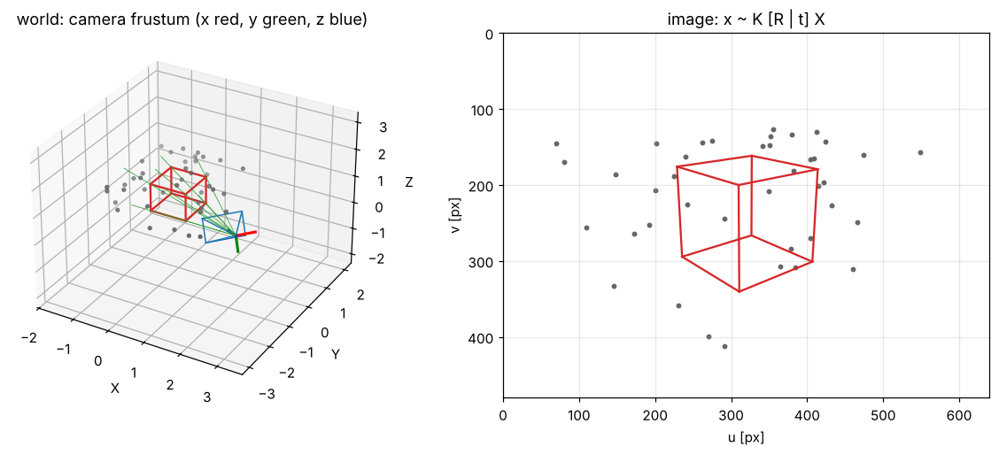
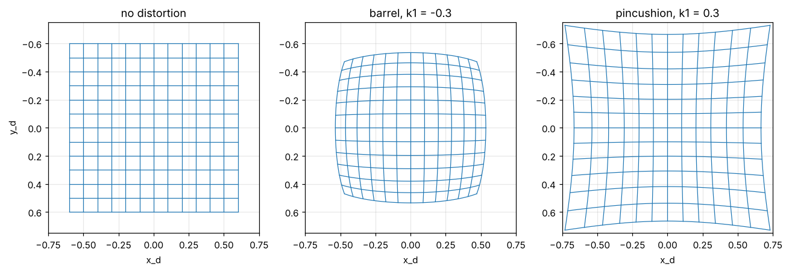

# 2 · The pinhole camera

A camera is a map from 3-D scene points to 2-D pixels. This chapter writes that map down as a chain of three
simple steps — a rigid motion into the camera frame, a central projection, and an affine change to pixel
units — then adds lens distortion, and inverts the chain to turn pixels back into rays.

Notation: [00_notation.md](00_notation.md). Code: [`cpp/include/mvg/camera.hpp`](../cpp/include/mvg/camera.hpp),
[`cpp/include/mvg/rotation.hpp`](../cpp/include/mvg/rotation.hpp).
Notebook: [`2_notebooks/exercises/02_pinhole_camera.ipynb`](../2_notebooks/exercises/02_pinhole_camera.ipynb).

## 2.1 Rotations

A rotation is a $3\times 3$ matrix with $R^\top R = I$ and $\det R = +1$; the set of them is the group $SO(3)$.
Three parametrizations are used in this module.

**Elementary rotations and Euler angles.** Rotations about the coordinate axes are

$$
R_x(\alpha) = \begin{pmatrix} 1 & 0 & 0 \\ 0 & \cos\alpha & -\sin\alpha \\ 0 & \sin\alpha & \cos\alpha \end{pmatrix},\quad
R_y(\beta) = \begin{pmatrix} \cos\beta & 0 & \sin\beta \\ 0 & 1 & 0 \\ -\sin\beta & 0 & \cos\beta \end{pmatrix},\quad
R_z(\gamma) = \begin{pmatrix} \cos\gamma & -\sin\gamma & 0 \\ \sin\gamma & \cos\gamma & 0 \\ 0 & 0 & 1 \end{pmatrix}. \tag{2.1}
$$

An Euler-angle sequence such as "XYZ" means the product $R = R_x(\theta_1) R_y(\theta_2) R_z(\theta_3)$, in that
order (rotations about the axes of the moving frame). There are twelve valid sequences, including the
repeated-axis ones such as "XYX"; always state which one is meant. Every sequence has *gimbal lock*: for one value
of the middle angle the first and third rotations act about the same axis and one degree of freedom is lost.

**Rotation vector (axis–angle).** A vector $\boldsymbol{\omega} = \theta \mathbf{n}$, $\lVert\mathbf{n}\rVert = 1$,
encodes the rotation by $\theta$ about $\mathbf{n}$. The map to the matrix is the exponential of the skew matrix
(1.6), given in closed form by **Rodrigues' formula**:

$$
R = \exp([\boldsymbol{\omega}]_\times) = I + \frac{\sin\theta}{\theta}[\boldsymbol{\omega}]_\times
  + \frac{1 - \cos\theta}{\theta^2}[\boldsymbol{\omega}]_\times^2 . \tag{2.2}
$$

For small $\theta$ use the Taylor expansions $\sin\theta/\theta \approx 1 - \theta^2/6$,
$(1-\cos\theta)/\theta^2 \approx 1/2 - \theta^2/24$. The inverse (**logarithm**) is

$$
\theta = \arccos\frac{\operatorname{tr} R - 1}{2},\qquad
[\boldsymbol{\omega}]_\times = \frac{\theta}{2\sin\theta}(R - R^\top) , \tag{2.3}
$$

which is ill-conditioned near $\theta = \pi$ (then $\sin\theta \to 0$); there the axis is taken from the column of
$R + I$ with the largest norm, because $R + I = 2\mathbf{n}\mathbf{n}^\top$ at $\theta = \pi$. The rotation vector
is the minimal (3-parameter) representation used inside every optimizer of the module (chapters 3, 8, 9).

**Nearest rotation.** A matrix $M$ that should be a rotation but is not (because it was estimated from noisy data)
is replaced by the closest rotation in the Frobenius norm: with $M = U\Sigma V^\top$,

$$
R = U \operatorname{diag}(1, 1, \det(UV^\top))\, V^\top . \tag{2.4}
$$

## 2.2 From world to camera: extrinsics

The **camera frame** has its origin at the centre of projection, the $Z_c$ axis along the optical axis (pointing
into the scene), $X_c$ to the right and $Y_c$ down, so that it lines up with the pixel axes $u$ (right) and $v$
(down). A world point $\tilde{\mathbf{X}}_w$ has camera coordinates

$$
\tilde{\mathbf{X}}_c = R\, \tilde{\mathbf{X}}_w + \mathbf{t} , \tag{2.5}
$$

where $R = R_{cw}$ and $\mathbf{t} = \mathbf{t}_{cw}$ describe the **world frame in camera coordinates** (the
"extrinsics"). The camera centre is the point with $\tilde{\mathbf{X}}_c = \mathbf{0}$:

$$
\tilde{\mathbf{C}} = -R^\top \mathbf{t},\qquad \mathbf{t} = -R\tilde{\mathbf{C}} . \tag{2.6}
$$

The pose of the camera in the world, which is what a robot's localization system reports, is the inverse,
$T_{wc} = \left(\begin{smallmatrix} R^\top & \tilde{\mathbf{C}} \\ \mathbf{0}^\top & 1 \end{smallmatrix}\right)$. Confusing
$T_{cw}$ with $T_{wc}$ is the single most frequent bug in multi-view code.

A convenient way to place a camera is **look-at**: given the centre $\tilde{\mathbf{C}}$, a target point
$\mathbf{p}$ and an "up" direction $\mathbf{a}$, the rows of $R$ are the camera axes expressed in the world frame,

$$
\mathbf{r}_3 = \frac{\mathbf{p} - \tilde{\mathbf{C}}}{\lVert\mathbf{p} - \tilde{\mathbf{C}}\rVert},\quad
\mathbf{r}_1 = \frac{\mathbf{r}_3 \times \mathbf{a}}{\lVert \mathbf{r}_3 \times \mathbf{a} \rVert}\ \text{(with } \mathbf{a} \text{ pointing up, } \mathbf{r}_1 \text{ points right)},\quad
\mathbf{r}_2 = \mathbf{r}_3 \times \mathbf{r}_1,\qquad
R = \begin{pmatrix} \mathbf{r}_1^\top \\ \mathbf{r}_2^\top \\ \mathbf{r}_3^\top \end{pmatrix} . \tag{2.7}
$$

## 2.3 Central projection and intrinsics

A pinhole at the origin projects the camera-frame point $(X_c, Y_c, Z_c)$ onto the plane $Z_c = 1$ at the
**normalized image coordinates**

$$
x_n = \frac{X_c}{Z_c},\qquad y_n = \frac{Y_c}{Z_c} . \tag{2.8}
$$

The sensor measures pixels. The change from normalized coordinates to pixels is affine: a scaling by the focal
length expressed in pixel units ($f_x = f/\Delta_u$, $f_y = f/\Delta_v$ for a physical focal length $f$ and pixel
pitches $\Delta_u, \Delta_v$), an optional skew $s$, and a shift to the **principal point** $(c_x, c_y)$:

$$
\begin{pmatrix} u \\ v \\ 1 \end{pmatrix} = K \begin{pmatrix} x_n \\ y_n \\ 1 \end{pmatrix},\qquad
K = \begin{pmatrix} f_x & s & c_x \\ 0 & f_y & c_y \\ 0 & 0 & 1 \end{pmatrix} . \tag{2.9}
$$

$s$ is zero for every modern sensor; it stays in the model because estimators (chapter 3) return a non-zero value
when the data are noisy. Chaining (2.5), (2.8) and (2.9) gives the **projection matrix**

$$
\mathbf{x} \simeq P\mathbf{X},\qquad P = K\,[R \mid \mathbf{t}] = KR\,[I \mid -\tilde{\mathbf{C}}] , \tag{2.10}
$$

a $3\times 4$ matrix of rank 3 with 11 degrees of freedom (5 intrinsic + 6 extrinsic). Its anatomy (HZ §6.2):

* the camera centre is the right null vector: $P\mathbf{C} = \mathbf{0}$ with $\mathbf{C} = (\tilde{\mathbf{C}}, 1)$;
* the third row $\mathbf{p}^{3\top}$ is the **principal plane** (points with $Z_c = 0$, which project to
  infinity), and $\mathbf{p}^{3\top}\mathbf{X}$ is the depth $Z_c$ when $\det(KR) > 0$ and $\mathbf{X}$ has
  $X_4 = 1$;
* the left $3\times 3$ block $M = KR$ maps directions: the vanishing point of the world direction $\mathbf{d}$ is
  $M\mathbf{d}$.

*Worked example* (checked in `cpp/tests/test_camera.cpp`). With $f_x = f_y = 500$, $(c_x, c_y) = (320, 240)$,
$s = 0$ and the camera at the world origin ($R = I$, $\mathbf{t} = \mathbf{0}$), the point $(0.2, -0.1, 2)$ has
$(x_n, y_n) = (0.1, -0.05)$ and lands on the pixel $(320 + 500 \cdot 0.1,\ 240 - 500 \cdot 0.05) = (370, 215)$.
A 640-pixel-wide image with $f_x = 320$ covers $2\arctan 1 = 90°$, eq. (2.11) below.

**Cheirality.** The model (2.8) also "sees" points behind the camera ($Z_c < 0$) and maps them to a perfectly
ordinary pixel — mirrored through the principal point. A real camera does not; code that projects arbitrary
points must test $Z_c > 0$. This test decides between the four solutions of the essential-matrix decomposition in
chapter 6.

**Field of view.** An image of width $w$ pixels covers the horizontal angle

$$
\text{FOV}_u = 2\arctan\frac{w}{2 f_x} . \tag{2.11}
$$

## 2.4 Lens distortion

Real lenses bend straight lines near the image border. The **Brown–Conrady** model (the one used by OpenCV)
distorts the normalized coordinates *before* $K$ is applied. With $r^2 = x_n^2 + y_n^2$:

$$
\begin{aligned}
x_d &= x_n\,(1 + k_1 r^2 + k_2 r^4 + k_3 r^6) + 2p_1 x_n y_n + p_2 (r^2 + 2x_n^2), \\
y_d &= y_n\,(1 + k_1 r^2 + k_2 r^4 + k_3 r^6) + p_1 (r^2 + 2y_n^2) + 2p_2 x_n y_n ,
\end{aligned} \tag{2.12}
$$

and $(u, v, 1)^\top = K (x_d, y_d, 1)^\top$. $k_1 < 0$ gives **barrel** distortion (wide-angle lenses), $k_1 > 0$
**pincushion**; $p_1, p_2$ model a lens that is not exactly parallel to the sensor.

**Undistortion** — recovering $(x_n, y_n)$ from $(x_d, y_d)$ — has no closed form. Write (2.12) as
$\mathbf{x}_d = \mathbf{d}(\mathbf{x}_n)$ and solve $\mathbf{d}(\mathbf{x}_n) - \mathbf{x}_d = \mathbf{0}$ with
Newton's method, starting from $\mathbf{x}_n^{(0)} = \mathbf{x}_d$:

$$
\mathbf{x}_n^{(k+1)} = \mathbf{x}_n^{(k)} - J_d(\mathbf{x}_n^{(k)})^{-1}\left(\mathbf{d}(\mathbf{x}_n^{(k)}) - \mathbf{x}_d\right) , \tag{2.13}
$$

with the Jacobian of (2.12), writing $k(r^2) = 1 + k_1 r^2 + k_2 r^4 + k_3 r^6$ and
$k'(r^2) = k_1 + 2k_2 r^2 + 3k_3 r^4$:

$$
J_d = \begin{pmatrix}
k + 2x_n^2 k' + 2p_1 y_n + 6p_2 x_n & 2x_n y_n k' + 2p_1 x_n + 2p_2 y_n \\
2x_n y_n k' + 2p_1 x_n + 2p_2 y_n & k + 2y_n^2 k' + 6p_1 y_n + 2p_2 x_n
\end{pmatrix} . \tag{2.14}
$$

Newton converges in a handful of iterations inside the region where $\mathbf{d}$ is invertible. That region is
bounded: for $k_1 < 0$ the radial map $r \mapsto r(1 + k_1 r^2)$ reaches a maximum at $r = 1/\sqrt{-3k_1}$ and folds
back, so pixels beyond the fold have two pre-images and undistortion silently picks one (notebook, "break it").

## 2.5 Back-projection

A pixel does not determine a point, only a **ray**. Undo $K$ (and the distortion), then rotate into the world:

$$
\mathbf{X}(\lambda) = \tilde{\mathbf{C}} + \lambda\, R^\top K^{-1} \mathbf{x},\qquad \lambda > 0 . \tag{2.15}
$$

With $\mathbf{x} = (u, v, 1)^\top$, the parameter $\lambda$ equals the depth $Z_c$ of the point, since the third
component of $K^{-1}\mathbf{x}$ is 1. If the depth is known (a depth camera, stereo in chapter 7) the point is
$\tilde{\mathbf{X}}_c = Z_c K^{-1}\mathbf{x}$, then $\tilde{\mathbf{X}}_w = R^\top(\tilde{\mathbf{X}}_c - \mathbf{t})$.
If instead the point is known to lie on a plane $\boldsymbol{\pi}^\top\mathbf{X} = 0$, intersecting the ray with
it gives the point — the basis of the plane homographies of chapter 5.

## 2.6 Derivatives of the projection

Every non-linear estimator in this module (calibration, PnP, visual odometry) needs the derivative of the pixel
with respect to the point. For $\mathbf{X}_c = (X, Y, Z)$ and no distortion, differentiating (2.8)–(2.9):

$$
\frac{\partial (u, v)}{\partial \mathbf{X}_c} =
\begin{pmatrix}
\dfrac{f_x}{Z} & \dfrac{s}{Z} & -\dfrac{f_x X + s Y}{Z^2} \\[2mm]
0 & \dfrac{f_y}{Z} & -\dfrac{f_y Y}{Z^2}
\end{pmatrix} . \tag{2.16}
$$

The chain rule with $\partial\mathbf{X}_c/\partial\tilde{\mathbf{X}}_w = R$ gives the derivative with respect to
the world point, and with a small rotation $R \leftarrow \exp([\boldsymbol{\delta}]_\times) R$,
$\partial\mathbf{X}_c / \partial\boldsymbol{\delta} = -[\mathbf{X}_c - \mathbf{t}]_\times$ evaluated at
$\boldsymbol{\delta} = 0$ (since $\exp([\boldsymbol{\delta}]_\times)R\tilde{\mathbf{X}}_w \approx R\tilde{\mathbf{X}}_w + \boldsymbol{\delta}\times R\tilde{\mathbf{X}}_w$).

## 2.7 Algorithm: projecting with the full model

Given world points $\tilde{\mathbf{X}}_{w,i}$ and a camera $(K, \text{distortion}, R, \mathbf{t})$:

1. $\tilde{\mathbf{X}}_c = R\tilde{\mathbf{X}}_w + \mathbf{t}$ (2.5). Flag points with $Z_c \le 0$ as not visible.
2. $(x_n, y_n) = (X_c/Z_c, Y_c/Z_c)$ (2.8).
3. Apply distortion (2.12) to get $(x_d, y_d)$.
4. $(u, v) = (f_x x_d + s\,y_d + c_x,\ f_y y_d + c_y)$ (2.9).
5. Flag pixels outside $[0, w) \times [0, h)$ as outside the image.

Back-projection runs the chain backwards: undo $K$ ($y_d = (v - c_y)/f_y$, $x_d = (u - c_x - s y_d)/f_x$),
undistort with (2.13), and use (2.15).

## 2.8 Common mistakes

* Using $R_{wc}$ (camera pose) where $R_{cw}$ (extrinsics) is expected, or vice versa; check with (2.6).
* Mixing pixel conventions: here the centre of the top-left pixel is $(0, 0)$ (as in OpenCV). Some tools use
  $(0.5, 0.5)$ or 1-based indices (MATLAB), which shifts $c_x, c_y$.
* Applying distortion to pixel coordinates instead of normalized coordinates.
* Forgetting cheirality: projecting points behind the camera.
* Euler angles without stating the sequence, or mixing degrees and radians.

## References

* R. Hartley, A. Zisserman. *Multiple View Geometry in Computer Vision*, 2nd ed., 2004. Chapter 6.
* R. Szeliski. *Computer Vision: Algorithms and Applications*, 2nd ed., 2022. Sections 2.1.4–2.1.6.
* D. C. Brown. "Decentering distortion of lenses." *Photogrammetric Engineering* 32(3), 1966.
* B. Siciliano, L. Sciavicco, L. Villani, G. Oriolo. *Robotics: Modelling, Planning and Control*. Springer, 2009.
  Section 2.4–2.7 (rotation representations).
* J. Solà, J. Deray, D. Atchuthan. "A micro Lie theory for state estimation in robotics." arXiv:1812.01537, 2018.
