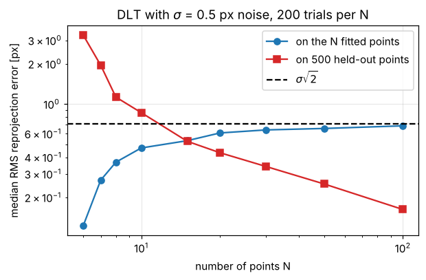
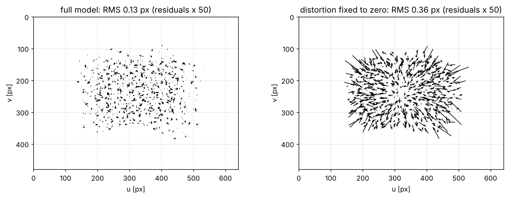

# 3 · Camera calibration

Calibration estimates the parameters of the camera model of chapter 2 from images of known points. This chapter
derives three estimators of increasing quality — the direct linear transform (DLT) for $P$, Zhang's planar
method for $K$, and a non-linear least-squares refinement of every parameter including distortion — and the
Levenberg–Marquardt algorithm that performs the refinement.

Notation: [00_notation.md](00_notation.md). Code: [`cpp/include/mvg/calibration.hpp`](../cpp/include/mvg/calibration.hpp),
[`cpp/include/mvg/optimization.hpp`](../cpp/include/mvg/optimization.hpp),
[`cpp/include/mvg/homography.hpp`](../cpp/include/mvg/homography.hpp).
Notebook: [`2_notebooks/exercises/03_calibration.ipynb`](../2_notebooks/exercises/03_calibration.ipynb).

## 3.1 What can be estimated from what

| Data | Unknowns | Minimum data | Method |
|---|---|---|---|
| $N$ known 3-D points, one image | $P$ (11 dof) | 6 points in general position (not coplanar) | DLT, §3.3 |
| $P$ | $K, R, \mathbf{t}$ | — | RQ decomposition, §3.4 |
| $M$ images of a known plane | $K$ (5 dof) + 6 per view | 3 views (2 if $s = 0$) | Zhang, §3.6 |
| any of the above | all parameters incl. distortion | — | non-linear least squares, §3.7 |

Each correspondence $\tilde{\mathbf{X}}_i \leftrightarrow \tilde{\mathbf{x}}_i$ gives two equations, hence the
counts: $2N \ge 11$ for $P$, and $2N \ge 8$ for a plane-to-image homography ($N \ge 4$).

## 3.2 Data normalization

Linear estimators solve a homogeneous system $A\mathbf{p} = \mathbf{0}$ whose entries are products of
coordinates. With pixel coordinates of order $10^2$–$10^3$ and a homogeneous 1, the entries of $A$ span six
orders of magnitude and the solution is dominated by rounding and noise in the large entries. Hartley (1997)
showed that a simple change of coordinates fixes this: translate the points so that their centroid is the origin
and scale them so that their mean distance from it is $\sqrt{2}$ (for image points) or $\sqrt{3}$ (for 3-D points),

$$
T = \begin{pmatrix} \sigma & 0 & -\sigma\bar{u} \\ 0 & \sigma & -\sigma\bar{v} \\ 0 & 0 & 1 \end{pmatrix},\qquad
\sigma = \frac{\sqrt{2}}{\frac{1}{N}\sum_i \lVert \tilde{\mathbf{x}}_i - \bar{\mathbf{x}} \rVert} , \tag{3.1}
$$

and the $4\times 4$ analogue $U$ for 3-D points. Estimate in normalized coordinates
$\hat{\mathbf{x}}_i = T\mathbf{x}_i$, $\hat{\mathbf{X}}_i = U\mathbf{X}_i$, then undo the change:

$$
P = T^{-1} \hat{P}\, U,\qquad H = T'^{-1} \hat{H}\, T . \tag{3.2}
$$

Normalization is not optional: without it the DLT is not invariant to the choice of image coordinates. For the
homography DLT the error grows by more than an order of magnitude once the coordinates are offset from the origin by
tens of times their spread (notebook, "break it"); for the 8-point algorithm of chapter 6 the effect is larger still.

## 3.3 The direct linear transform (DLT) for $P$

$\mathbf{x}_i \simeq P\mathbf{X}_i$ says the two vectors are parallel: $\mathbf{x}_i \times P\mathbf{X}_i = \mathbf{0}$.
Writing $\mathbf{p}^{j\top}$ for the rows of $P$ and $\mathbf{x}_i = (x_i, y_i, w_i)^\top$, two of the three
components of the cross product are independent (HZ eq. 7.2):

$$
\begin{pmatrix}
\mathbf{0}^\top & -w_i \mathbf{X}_i^\top & y_i \mathbf{X}_i^\top \\
w_i \mathbf{X}_i^\top & \mathbf{0}^\top & -x_i \mathbf{X}_i^\top
\end{pmatrix}
\begin{pmatrix} \mathbf{p}^1 \\ \mathbf{p}^2 \\ \mathbf{p}^3 \end{pmatrix} = \mathbf{0} . \tag{3.3}
$$

Stacking $N$ correspondences gives $A\mathbf{p} = \mathbf{0}$ with $A \in \mathbb{R}^{2N\times 12}$. With noise there
is no exact solution; minimize the **algebraic error** $\lVert A\mathbf{p}\rVert$ subject to
$\lVert\mathbf{p}\rVert = 1$. The minimizer is the right singular vector of $A$ for the smallest singular value
(the last column of $V$ in $A = U\Sigma V^\top$).

The figure above (generated by `tools/make_figures.py`) shows a property of every least-squares fit: the error on
the points used for the fit *grows* with $N$ towards the noise level $\sigma\sqrt{2}$, while the error on new points
— the actual accuracy — falls.

**Algorithm** (`estimate_projection_dlt`):

1. Normalize the image points with $T$ and the scene points with $U$ (3.1).
2. Build $A$ from (3.3), two rows per correspondence.
3. $\hat{\mathbf{p}}$ = last right singular vector of $A$; reshape to $\hat{P}$ ($3\times 4$, row-major).
4. Denormalize with (3.2).

**Degenerate configurations.** If all $\mathbf{X}_i$ lie on one plane the system has a 4-dimensional null space
and $P$ is not determined (HZ §7.1.1) — use the planar method of §3.6 instead. Points on a twisted cubic through
the camera centre are also degenerate.

**Hall's method** (the inhomogeneous variant). Fixing $p_{34} = 1$ removes the scale ambiguity and turns
(3.3) into an ordinary linear least-squares problem in 11 unknowns. Dividing $u_i = \mathbf{p}^{1\top}\mathbf{X}_i / \mathbf{p}^{3\top}\mathbf{X}_i$
by the denominator and rearranging, each point with $\mathbf{X}_i = (X_i, Y_i, Z_i, 1)$ gives

$$
\begin{pmatrix}
X_i & Y_i & Z_i & 1 & 0 & 0 & 0 & 0 & -u_i X_i & -u_i Y_i & -u_i Z_i \\
0 & 0 & 0 & 0 & X_i & Y_i & Z_i & 1 & -v_i X_i & -v_i Y_i & -v_i Z_i
\end{pmatrix} \mathbf{a} = \begin{pmatrix} u_i \\ v_i \end{pmatrix} , \tag{3.4}
$$

with $\mathbf{a} = (p_{11}, \dots, p_{14}, p_{21}, \dots, p_{24}, p_{31}, p_{32}, p_{33})^\top$. It gives the same answer
as the DLT on noise-free data but it fails when the true $p_{34}$ is close to zero, i.e. when the origin of the world
frame lies near the principal plane of the camera ($p_{34} = \mathbf{p}^{3\top}(0,0,0,1)^\top$ is the depth of the
world origin). The DLT has no such blind spot.

## 3.4 Decomposing $P$ into $K$, $R$, $\mathbf{t}$

The left block of $P = K[R \mid \mathbf{t}]$ is $M = KR$: an upper-triangular matrix times a rotation. That is
exactly an **RQ decomposition**. Using the reversal permutation $E$ (ones on the anti-diagonal, $E = E^\top = E^{-1}$),
an RQ decomposition follows from a QR decomposition:

$$
(EM)^\top = Q'R' \quad\Rightarrow\quad M = E\,R'^\top Q'^\top = \underbrace{(E R'^\top E)}_{K\ \text{upper}}\ \underbrace{(E Q'^\top)}_{R} . \tag{3.5}
$$

**Algorithm** (`decompose_projection`):

1. If $\det M < 0$, replace $P$ by $-P$ (the overall sign of a homogeneous $P$ is arbitrary, but $R$ must have
   $\det R = +1$).
2. RQ-decompose $M = KR$ with (3.5).
3. Make the diagonal of $K$ positive: for each $i$ with $K_{ii} < 0$, negate column $i$ of $K$ and row $i$ of $R$
   (this leaves the product unchanged).
4. $\mathbf{t} = K^{-1}\mathbf{p}_4$ where $\mathbf{p}_4$ is the last column of $P$; then divide $K$ by $K_{33}$.
5. The centre is $\tilde{\mathbf{C}} = -R^\top\mathbf{t}$.

The skew $s = K_{12}$ returned from a noisy $P$ is not zero even for a camera with square pixels: the DLT does not
know that $s = 0$, so the 11 parameters absorb noise in all directions, skew included.

## 3.5 Homographies from a planar target

For points on the plane $Z = 0$ of the world frame, writing $\mathbf{r}_1, \mathbf{r}_2, \mathbf{r}_3$ for the
columns of $R$,

$$
\mathbf{x} \simeq K[\mathbf{r}_1\ \mathbf{r}_2\ \mathbf{r}_3\ \mathbf{t}](X, Y, 0, 1)^\top
= \underbrace{K[\mathbf{r}_1\ \mathbf{r}_2\ \mathbf{t}]}_{H}(X, Y, 1)^\top . \tag{3.6}
$$

The plane-to-image map is a homography. It is estimated with the same recipe as $P$: for $\mathbf{x}'_i \simeq H\mathbf{x}_i$,
$\mathbf{x}'_i \times H\mathbf{x}_i = \mathbf{0}$ gives two rows per point,

$$
\begin{pmatrix}
\mathbf{0}^\top & -w'_i \mathbf{x}_i^\top & y'_i \mathbf{x}_i^\top \\
w'_i \mathbf{x}_i^\top & \mathbf{0}^\top & -x'_i \mathbf{x}_i^\top
\end{pmatrix}
\mathbf{h} = \mathbf{0},\qquad \mathbf{h} = (\mathbf{h}^1; \mathbf{h}^2; \mathbf{h}^3) \in \mathbb{R}^9 , \tag{3.7}
$$

solved by SVD after normalizing both point sets with (3.1). Chapter 5 studies this estimator in detail and makes it
robust to outliers.

## 3.6 Zhang's method

From (3.6), $\mathbf{h}_1 = \lambda K\mathbf{r}_1$ and $\mathbf{h}_2 = \lambda K\mathbf{r}_2$ for the columns of
$H$ and some scale $\lambda$. Since $\mathbf{r}_1, \mathbf{r}_2$ are orthonormal,

$$
\mathbf{h}_1^\top B\, \mathbf{h}_2 = 0,\qquad \mathbf{h}_1^\top B\, \mathbf{h}_1 = \mathbf{h}_2^\top B\, \mathbf{h}_2,\qquad
B = K^{-\top}K^{-1} . \tag{3.8}
$$

$B$ is symmetric (it is the image of the absolute conic, HZ §8.5), so it has six distinct entries
$\mathbf{b} = (B_{11}, B_{12}, B_{22}, B_{13}, B_{23}, B_{33})^\top$, and $\mathbf{h}_i^\top B\mathbf{h}_j = \mathbf{v}_{ij}^\top\mathbf{b}$ with

$$
\mathbf{v}_{ij} = \left(h_{1i}h_{1j},\ h_{1i}h_{2j} + h_{2i}h_{1j},\ h_{2i}h_{2j},\ h_{3i}h_{1j} + h_{1i}h_{3j},\ h_{3i}h_{2j} + h_{2i}h_{3j},\ h_{3i}h_{3j}\right)^\top , \tag{3.9}
$$

where $h_{ki}$ is entry $k$ of column $i$ of $H$ (Zhang 2000, eq. 8). Each view contributes two rows,

$$
\begin{pmatrix} \mathbf{v}_{12}^\top \\ (\mathbf{v}_{11} - \mathbf{v}_{22})^\top \end{pmatrix} \mathbf{b} = \mathbf{0} . \tag{3.10}
$$

With $M \ge 3$ views, $\mathbf{b}$ is the last right singular vector of the stacked $2M \times 6$ matrix. With two views
add the zero-skew constraint $B_{12} = 0$ as the row $(0, 1, 0, 0, 0, 0)$.

**Recovering $K$ from $B$.** $B \propto K^{-\top}K^{-1} = A^\top A$ with $A = K^{-1}$ upper triangular. If $B$ is
positive definite, its Cholesky factorization $B = U^\top U$ ($U$ upper triangular, positive diagonal) gives
$U \propto K^{-1}$, hence

$$
K = U^{-1} / (U^{-1})_{33} . \tag{3.11}
$$

The SVD returns $\mathbf{b}$ only up to sign: if $B$ is negative definite, use $-B$. (Zhang's paper gives the
equivalent closed-form expressions for the five entries of $K$.)

**Extrinsics of each view.** From (3.6), with $\lambda = 1/\lVert K^{-1}\mathbf{h}_1\rVert$:

$$
\mathbf{r}_1 = \lambda K^{-1}\mathbf{h}_1,\quad \mathbf{r}_2 = \lambda K^{-1}\mathbf{h}_2,\quad
\mathbf{r}_3 = \mathbf{r}_1 \times \mathbf{r}_2,\quad \mathbf{t} = \lambda K^{-1}\mathbf{h}_3 . \tag{3.12}
$$

Choose the sign of $\lambda$ so that $t_z > 0$ (the target is in front of the camera), and replace
$[\mathbf{r}_1\ \mathbf{r}_2\ \mathbf{r}_3]$ by the nearest rotation (2.4), because with noise it is not exactly orthonormal.

**Degenerate views.** Two views related by a pure translation, or by a rotation about the optical axis, give
proportional constraints. In particular, views where the target is parallel to the image plane carry no
information about the focal length (the notebook shows the singular values of the stacked matrix collapsing).
Tilt the target by 20°–50° in different directions.

## 3.7 Maximum-likelihood refinement

The linear estimates minimize algebraic quantities without a physical meaning. If the image measurements are
corrupted by independent isotropic Gaussian noise, the maximum-likelihood estimate minimizes the **reprojection
error**

$$
E(\boldsymbol{\theta}) = \sum_{v=1}^{M} \sum_{i=1}^{N} \left\lVert \tilde{\mathbf{x}}_{vi} - \pi\!\left(K, \mathbf{k}, R_v, \mathbf{t}_v, \tilde{\mathbf{X}}_i\right) \right\rVert^2 , \tag{3.13}
$$

where $\pi$ is the full projection of section 2.7 and $\mathbf{k}$ the distortion coefficients. Rotations are
parametrized by rotation vectors, $R_v = \exp([\boldsymbol{\omega}_v]_\times)$ (2.2), so that the parameter vector

$$
\boldsymbol{\theta} = (f_x, f_y, c_x, c_y, s, k_1, k_2, p_1, p_2, k_3, \boldsymbol{\omega}_1, \mathbf{t}_1, \dots, \boldsymbol{\omega}_M, \mathbf{t}_M)
$$

has no constraints. Parameters can be held fixed (e.g. $s = 0$, $k_3 = 0$) by removing them from the optimization.
The linear solution of §3.6 with zero distortion is the starting point. The final **RMS reprojection error**
$\sqrt{E/(MN)}$ is reported in pixels. If each image coordinate carries independent noise of standard deviation
$\sigma$, the expected RMS of the 2-D error is $\sigma\sqrt{2}\sqrt{1 - n_\theta/(2MN)}$ with $n_\theta$ free
parameters — slightly *below* $\sigma\sqrt{2}$, because the fit absorbs part of the noise. For a good calibration it
is close to the noise level of the corner detector, typically 0.1–0.5 px.

Residuals are the best diagnostic of a calibration: random residuals at the noise level mean the model fits;
residuals with structure — here pointing radially — mean a term is missing from the model.

## 3.8 The Levenberg–Marquardt algorithm

Problem: minimize $E(\boldsymbol{\theta}) = \lVert\mathbf{r}(\boldsymbol{\theta})\rVert^2$ for a residual vector
$\mathbf{r} \in \mathbb{R}^m$, $\boldsymbol{\theta} \in \mathbb{R}^n$. Linearize the residual around the current
estimate, $\mathbf{r}(\boldsymbol{\theta} + \boldsymbol{\delta}) \approx \mathbf{r} + J\boldsymbol{\delta}$ with the
Jacobian $J = \partial\mathbf{r}/\partial\boldsymbol{\theta}$. Minimizing the linearized cost gives the
**Gauss–Newton** step $J^\top J\boldsymbol{\delta} = -J^\top\mathbf{r}$. It converges fast near the minimum but can
diverge far from it or when $J^\top J$ is singular. Levenberg's idea is to blend it with gradient descent by adding a
damping term; Marquardt scaled the damping with the diagonal of $J^\top J$ so that the step is invariant to the units
of each parameter:

$$
\left(J^\top J + \lambda\, \operatorname{diag}(J^\top J)\right)\boldsymbol{\delta} = -J^\top\mathbf{r} . \tag{3.14}
$$

Large $\lambda$: a short step along the (scaled) negative gradient. Small $\lambda$: the Gauss–Newton step.

**Algorithm** (`levenberg_marquardt`):

1. Start at $\boldsymbol{\theta}_0$ with $\lambda = 10^{-3}$; evaluate $\mathbf{r}$ and $E$.
2. Compute $J$ (analytically if available, otherwise by central differences
   $J_{:,k} \approx (\mathbf{r}(\boldsymbol{\theta} + h\mathbf{e}_k) - \mathbf{r}(\boldsymbol{\theta} - h\mathbf{e}_k)) / 2h$ with
   $h = 10^{-6}\max(1, |\theta_k|)$).
3. Stop if the gradient is small: $\lVert J^\top\mathbf{r}\rVert_\infty < \varepsilon_g$.
4. Solve (3.14) for $\boldsymbol{\delta}$ (Cholesky; add $10^{-12}$ to the diagonal if a parameter has no
   influence).
5. If $E(\boldsymbol{\theta} + \boldsymbol{\delta}) < E(\boldsymbol{\theta})$: accept the step and set
   $\lambda \leftarrow \lambda/10$. Otherwise reject it, set $\lambda \leftarrow 10\lambda$, and go back to 4.
6. Stop when the relative decrease of $E$ or the relative step $\lVert\boldsymbol{\delta}\rVert / \lVert\boldsymbol{\theta}\rVert$
   falls below a tolerance, or after a maximum number of iterations; otherwise go to 2.

The same routine refines homographies (chapter 5), poses (chapter 8) and visual-odometry motion (chapter 9).

## 3.9 Common mistakes

* Running the DLT on raw pixel coordinates (no normalization).
* Calibrating from coplanar points with the 3-D DLT, or from fronto-parallel views with Zhang's method.
* Reporting the RMS error on the calibration images only: it always decreases with more parameters. Judge a
  calibration on held-out points or images.
* Forgetting that the sign of a homogeneous solution is arbitrary — enforce $\det R = +1$ and positive depth.
* Mixing up which coordinates distortion applies to (normalized, not pixels).

## References

* R. Hartley, A. Zisserman. *Multiple View Geometry in Computer Vision*, 2nd ed., 2004. Chapters 4 (DLT,
  normalization), 6.2 (decomposition), 7 (calibration), A6 (Levenberg–Marquardt).
* R. Hartley. "In defense of the eight-point algorithm." *IEEE TPAMI* 19(6), 1997 (normalization).
* Z. Zhang. "A flexible new technique for camera calibration." *IEEE TPAMI* 22(11), 2000.
* E. L. Hall, J. B. K. Tio, C. A. McPherson, F. A. Sadjadi. "Measuring curved surfaces for robot vision."
  *Computer* 15(12), 1982.
* D. W. Marquardt. "An algorithm for least-squares estimation of nonlinear parameters." *SIAM J. Appl. Math.*
  11(2), 1963.
* J. Nocedal, S. J. Wright. *Numerical Optimization*, 2nd ed. Springer, 2006. Chapter 10.
